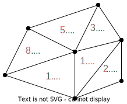

---
jupytext:
  formats: ipynb,md:myst
  text_representation:
    extension: .md
    format_name: myst
    format_version: 0.13
    jupytext_version: 1.13.8
kernelspec:
  display_name: gt4py
  language: python
  name: gt4py
---

```{code-cell} ipython3
---
slideshow:
  slide_type: skip
---
import warnings
warnings.filterwarnings('ignore')
```

+++ {"slideshow": {"slide_type": "slide"}}

# Introduction to the `gt4py` functional frontend

+++ {"slideshow": {"slide_type": ""}}

## Repositories
- [gt4py](https://github.com/GridTools/gt4py/tree/functional)
- [icon4py](https://github.com/C2SM/icon4py)
- [icon-exclaim](https://github.com/C2SM/icon-exclaim/tree/icon-dsl)

## Installation

You can install the library directly from GitHub using pip:

`pip install git+https://github.com/gridtools/gt4py.git@functional`

###### To follow along
https://github.com/samkellerhals/gt4py-introduction

+++ {"slideshow": {"slide_type": "slide"}}

## Today's topics

### Key concepts and application structure in `gt4py`

This section introduces various concepts for storing and manipulating data:
- Fields
- Field operators
- Programs
- Field offsets


### An introduction to porting dusk stencils

- Porting `dusk` to `gt4py`.
- Unit testing `gt4py` stencils.

+++ {"slideshow": {"slide_type": "slide"}}

### Required imports for this session

```{code-cell} ipython3
---
slideshow:
  slide_type: '-'
---
import numpy as np

from functional.ffront.fbuiltins import Dimension, Field, FieldOffset, neighbor_sum

from functional.ffront.decorator import field_operator, program

from functional.iterator.embedded import np_as_located_field, NeighborTableOffsetProvider
```

+++ {"slideshow": {"slide_type": "slide"}}

### Fields

- Store data as a multi-dimensional array.

- Are defined over a set of named dimensions.

```{code-cell} ipython3
---
slideshow:
  slide_type: fragment
---
CellDim = Dimension("Cell")
KDim = Dimension("K")

num_cells = 5
num_layers = 6
grid_shape = (num_cells, num_layers)

a_value = 2.0
b_value = 3.0

a = np_as_located_field(CellDim, KDim)(np.full(shape=grid_shape, fill_value=a_value, dtype=float))
b = np_as_located_field(CellDim, KDim)(np.full(shape=grid_shape, fill_value=b_value, dtype=float))

print(a.array(), type(a))
```

+++ {"slideshow": {"slide_type": "skip"}}

*Note: The interface to construct fields is provisional only and will change soon.*

+++ {"slideshow": {"slide_type": "slide"}}

### Field operators

*The place where we express the computational pattern of a stencil*

- Field operators perform operations on one (or more) **Fields**.

- You can write field operators as Python functions by using the `@field_operator` decorator.

```{code-cell} ipython3
---
slideshow:
  slide_type: fragment
---
@field_operator
def add(a: Field[[CellDim, KDim], float],
        b: Field[[CellDim, KDim], float]) -> Field[[CellDim, KDim], float]:
    return a + b
```

+++ {"slideshow": {"slide_type": "slide"}}

### Calling field operators

You can call a `@field_operator` from:

- Programs
- Other field operators
- Directly 

```{code-cell} ipython3
---
slideshow:
  slide_type: fragment
---
# construct the output field
output = np_as_located_field(CellDim, KDim)(np.zeros(shape=grid_shape))

# call the field operator
add(a, b, out=output, offset_provider={})

print(output.array())
```

+++ {"slideshow": {"slide_type": "slide"}}

### Programs

+++

Programs let you group together multiple field operator calls as a sequence of operations.

In contrast to a `@field_operator` a `@program` can mutate its arguments.

```{code-cell} ipython3
---
slideshow:
  slide_type: fragment
---
@program
def run_add(a: Field[[CellDim, KDim], float],
            b: Field[[CellDim, KDim], float],
            output: Field[[CellDim, KDim], float]):
    add(a, b, out=output)
    add(b, output, out=output)
```

+++ {"slideshow": {"slide_type": "slide"}}

Run the program by calling it:

```{code-cell} ipython3
# construct the output field
output = np_as_located_field(CellDim, KDim)(np.zeros(shape=grid_shape))

print(f"Before:\n {output.array()}\n")

# call the program
run_add(a, b, output, offset_provider={})

print(f"After:\n {output.array()}")
```

+++ {"slideshow": {"slide_type": "slide"}}

### Operations on unstructured meshes

We can use field operators to define operations on unstructured meshes, which also involve values on neighboring **cells**, **edges**, or **vertexes**.

+++ {"slideshow": {"slide_type": "-"}}

#### Defining the mesh and its connectivities

The examples related to unstructured meshes use the mesh below. The edges (in blue) and the cells (in red) are numbered with zero-based indices.

|  |
|:---------------:| 
| *The mesh with the indices* |

+++ {"slideshow": {"slide_type": "slide"}}

### Defining connectivities

To run computations that access neighboring values, the connectivity between elements must be defined.

This can be acheived using neighborhood tables such as the ones below:

```{code-cell} ipython3
---
slideshow:
  slide_type: fragment
---
edge_to_cell_table = np.array([
    [0, None], # edge 0 (neighbours: cell 0)
    [2, None], # edge 1
    [2, None], # edge 2
    [3, None], # edge 3
    [4, None], # edge 4
    [5, None], # edge 5
    [0, 5],  # edge 6 (neighbours: cell 0, cell 5)
    [0, 1],  # edge 7
    [1, 2],  # edge 8
    [1, 3],  # edge 9
    [3, 4],  # edge 10
    [4, 5]   # edge 11
])

cell_to_edge_table = np.array([
    [0, 6, 7],   # cell 0 (neighbors: edge 0, edge 6, edge 7)
    [7, 8, 9],   # cell 1
    [1, 2, 8],   # cell 2
    [3, 9, 10],  # cell 3
    [4, 10, 11], # cell 4
    [5, 6, 11],  # cell 5
])
```

+++ {"slideshow": {"slide_type": "slide"}}

### Using connectivities to access neighboring cell values

We want to define a field operator which will: 

- Find the first neighboring cell of each edge in the mesh.
- Take the cell value of the first neighbor and store it inside the edge.

||| $\mapsto$ | |
|:--:|:--:| :--: | :--: |
| *Cell values* | *Domain (edges)*  |Transform| *Edge values* |

+++ {"slideshow": {"slide_type": "slide"}}

### Field Offsets

- A `FieldOffset` transforms a `Field` from one domain to another (e.g. `Cell` to `Edge`).

- Uses connectivities between source and target dimensions to find values.

+++ {"slideshow": {"slide_type": "skip"}}

Let's start by defining two fields: one over the cells and another one over the edges. The field over cells serves input for subsequent calculations and is therefore filled up with values, whereas the field over the edges stores the output of the calculations and is therefore left blank.

```{code-cell} ipython3
---
slideshow:
  slide_type: fragment
---
CellDim = Dimension("Cell")
EdgeDim = Dimension("Edge")

cell_values = np_as_located_field(CellDim)(np.array([1.0, 1.0, 2.0, 3.0, 5.0, 8.0]))
edge_values = np_as_located_field(EdgeDim)(np.zeros((12,)))

E2CDim = Dimension("E2C", local=True)
E2C = FieldOffset("E2C", source=CellDim, target=(EdgeDim, E2CDim))
```

+++ {"slideshow": {"slide_type": "fragment"}}

*Note:* The actual connectivity table is provided through an *OffsetProvider*:

```{code-cell} ipython3
E2C_offset_provider = NeighborTableOffsetProvider(edge_to_cell_table, EdgeDim, CellDim, 2)
```

+++ {"slideshow": {"slide_type": "slide"}}

### Find the nearest cell value to an edge

We can index into the *Edge to Cell* dimension selecting the first neighbor using `E2C[0]`

```{code-cell} ipython3
@field_operator
def nearest_cell_to_edge(cell_values: Field[[CellDim], float]) -> Field[[EdgeDim], float]:
    return cell_values(E2C[0])

nearest_cell_to_edge(cell_values, out=edge_values, offset_provider={"E2C": E2C_offset_provider})

print("0th adjacent cell's value: {}".format(np.asarray(edge_values)))
```

+++ {"slideshow": {"slide_type": "fragment"}}

||
|:--:|
|Edge Values|

+++ {"slideshow": {"slide_type": "slide"}}

### Using reductions on connected mesh elements


- We can also use *FieldOffsets* to implement reductions.

- One example is a sum across neighboring cells along the `E2C` dimension.

||| $\mapsto$ | |
|:--:|:--:| :--: | :--: |
| *Cell values* | *Domain (edges)*  |Transform| *Edge values* |

+++ {"slideshow": {"slide_type": "slide"}}

The field operator for the neighbor sum is as follows:

```{code-cell} ipython3
---
slideshow:
  slide_type: '-'
---
@field_operator
def sum_adjacent_cells(cells: Field[[CellDim], float]) -> Field[[EdgeDim], float]:
    return neighbor_sum(cells(E2C), axis=E2CDim)

sum_adjacent_cells(cell_values, out=edge_values, offset_provider={"E2C": E2C_offset_provider})

print("sum of adjacent cells: {}".format(np.asarray(edge_values)))
```

+++ {"slideshow": {"slide_type": "fragment"}}

||
|:--:|
|Edge Values|

+++ {"slideshow": {"slide_type": "slide"}}

#### Introduction to Dusk and Stencil Porting
